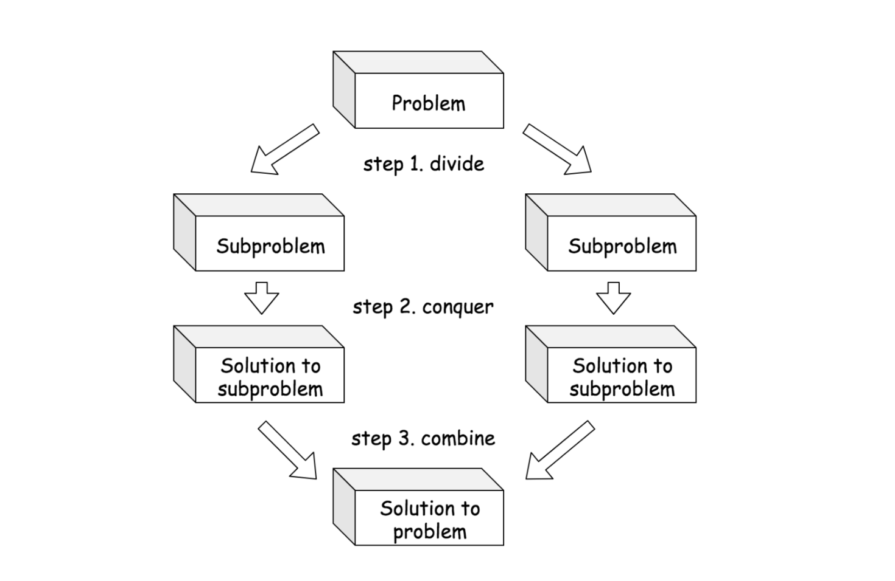

# Algorithms
## Catalan Numbers
- The Catalan numbers form a sequence that starts like this: 1, 1, 2, 5, 14, 42, 132, ...

### Formula for Catalan Numbers
```
        n-1
  Cn  = ∑ Ci × Cn-1-i
        i=0
```

### Example 1: Arranging Parentheses (Brackets)
- Imagine you have 3 pairs of parentheses: ()()(). You want to know how many different ways you can arrange them so that they always stay balanced.
- Balanced arrangements for 3 pairs of parentheses: 5 (the 3rd Catalan number).

### Example 2: Building a Path in a Grid
- Walking on a grid, starting at the bottom-left corner, to reach the top-right corner by moving either right or up but never crossing the diagonal.
- For a 2x2 grid, there are 2 valid ways, representing the 2nd Catalan number.

## Backtracking
### Constraint Satisfaction Problems (CSP)
- Involves finding the right answers for variables (like filling in a puzzle) that meet specific rules (constraints).

### Examples of CSPs
- **Scheduling**: Making a school timetable or figuring out a study plan.
- **Games**: Solving puzzles like Sudoku.
- **Planning**: Deciding the order of cities to visit for minimal gas usage.
- **Permutations**: Generating permutations is also a backtracking problem.

## Divide and Conquer
- TODO: Add documentation and complete study materials from [LeetCode](https://leetcode.com/explore/featured/card/recursion-ii/470/divide-and-conquer/2874/).

## Recursion
### Base Case and Recurrence Relation
- A recurrence relation can include more than just recursive calls. It often involves additional operations, arithmetic computations, or constants that make the relation more expressive.

### Tail Recursion
- The recursive call is the final instruction in the function.
- Good for space complexity since the system can reuse a fixed amount of space in the stack for each recursive call.

### Time Complexity
Given a recursion algorithm, the time complexity O(T) is typically the product of the number of recursion invocations (denoted as R) and the complexity of calculations (denoted as O(s)) during each recursion call:
  - **O(T) = R * O(s)**

#### Time Complexity with Execution Tree
For an N-ary tree, the time complexity would be **O(N^n)**, where **n** is the number of recursive calls and **N** is the number of recursions.

## Prefix Sum
- A prefix sum is an array where each element contains the sum of all previous elements up to and including the current one.
- Useful for efficiently answering range sum queries.

```
def calculate_prefix_sum(arr):
    prefix_sum = [0] * len(arr)
    prefix_sum[0] = arr[0]

    for i in range(1, len(arr)):
        prefix_sum[i] = prefix_sum[i - 1] + arr[i]

    return prefix_sum

# Example usage:
arr = [1, 2, 3, 4, 5]
prefix_sum = calculate_prefix_sum(arr)
print(prefix_sum)  # Output: [1, 3, 6, 10, 15]
```

## Dynamic Programming with Binary Search
### while (left <= right) vs while (left < right)
- **`while (left <= right)`**: Typically used in binary search to ensure all elements are considered.
- **`while (left < right)`**: Used for specific boundary or condition search within an array.

**Example**:
```
const longestSubsequence = nums => {
  let dp = [];

  for(let num of nums) {
    let left = 0, right = dp.length;

    while(left < right) {
      let midPoint = Math.floor((right + left) / 2);
      if(dp[midPoint] < num) {
        left = midPoint + 1;
      } else {
        right = midPoint;
      }
    }
    dp[left] = num;
  }
  return dp.length;
}

console.log(longestSubsequence([10, 9, 2, 5, 3, 7, 101, 18]));
```

## Kadane's Algorithm
- Kadane's Algorithm is used to find the maximum sum subarray in O(n) time.
- **Key Variables**:
  - **`current_max`**: The maximum sum of the subarray ending at the current position.
  - **`global_max`**: The maximum sum encountered so far across all subarrays.

**Example**:
```
const kadaneAlgorithm = (arr) => {
  if(arr.length === 0) return 0;
  let localMax = 0, globalMax = 0;
  arr.forEach(item => {
    localMax = Math.max(item, localMax + item);
    globalMax = Math.max(localMax, globalMax);
  });
  return globalMax;
}

const arr = [-2, 1, -3, 4, -1, 2, 1, -5, 4];
console.log(kadaneAlgorithm(arr));  // Output: 6
```

## Topological Sort
- Used to determine the ordering of nodes in a **DAG** (Directed Acyclic Graph).

### Kahn's Algorithm
- Can be used to find a topological sort list.
- **Time Complexity and Space Complexity**: **O(m + n)**, where **m** is the number of edges, and **n** is the in-degree count.

```
var findOrder = function(numCourses, prerequisites) {
  const graph = Array.from({ length: numCourses }, () => []);
  const inDegrees = Array(numCourses).fill(0);

  prerequisites.forEach(([course, prereq]) => {
    graph[prereq].push(course);
    inDegrees[course]++;
  });

  const queue = [];
  inDegrees.forEach((degree, course) => {
    if (degree === 0) queue.push(course);
  });

  const topoSort = [];
  while (queue.length > 0) {
    const course = queue.shift();
    topoSort.push(course);

    for (let neighbor of graph[course]) {
      inDegrees[neighbor]--;
      if (inDegrees[neighbor] === 0) {
        queue.push(neighbor);
      }
    }
  }

  return topoSort.length === numCourses ? topoSort : [];
};
```


## Subset
The subsets can be computed using backtracking and the time complexity is O((2 ^ N) * N) (additional N because you may be added candidate to a result container).


## Divide and Conquer
A divide-and-conquer algorithm works by recursively breaking the problem down into two or more subproblems of the same or related type, until these subproblems become simple enough to be solved directly [1]. Then one combines the results of subproblems to form the final solution.


### Template
There are in general three steps that one can follow in order to solve the problem in a divide-and-conquer manner.

***1. Divide.*** Divide the problem `S` into a set of subproblems: `{S1, S2, ... Sn}` where `n ≥ 2` i.e. there are usually more than one subproblem.

***2. Conquer.*** Solve each subproblem recursively. 

***3. Combine.*** Combine the results of each subproblem.




We can summarize the above steps in the following pseudocode template.

```
def divide_and_conquer( S ):
    # (1). Divide the problem into a set of subproblems.
    [S1, S2, ... Sn] = divide(S)

    # (2). Solve the subproblem recursively,
    #   obtain the results of subproblems as [R1, R2... Rn].
    rets = [divide_and_conquer(Si) for Si in [S1, S2, ... Sn]]
    [R1, R2,... Rn] = rets

    # (3). combine the results from the subproblems.
    #   and return the combined result.
    return combine([R1, R2,... Rn])
```

As one can see from the above template, the essential part of the divide and conquer is to figure out the recurrence relationship between the subproblems and the original problem, which subsequently defines the functions of divide() and combine(). 


## Decrease and Conquer
As you can see, divide-and-conquer algorithm is naturally implemented in the form of recursion. Another subtle difference that tells a divide-and-conquer algorithm apart from other recursive algorithms is that we break the problem down into two or more subproblems in the divide-and-conquer algorithm, rather than a single smaller subproblem. The latter recursive algorithm sometimes is called decrease and conquer instead, such as Binary Search.

